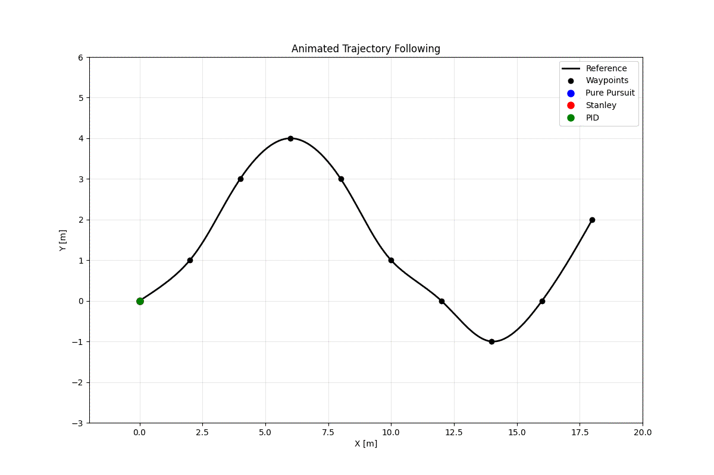
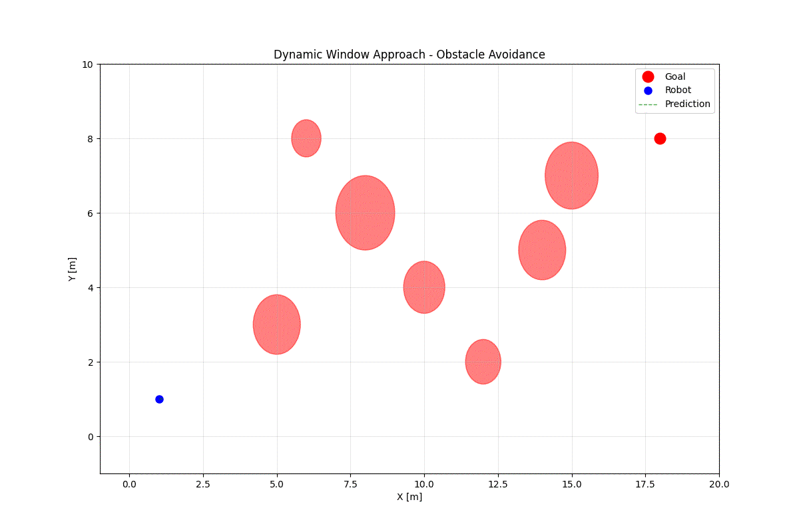

# 10x_Path_Smoothing

A ROS-based project for trajectory smoothing and following with TurtleBot. This repository implements a path smoothing pipeline that enables a TurtleBot to plan a trajectory, apply smoothing algorithms, and follow the resultant optimal path in simulation. 

## Overview

This package is designed for robotics simulation environments where path planning and execution are critical. The core feature is trajectory smoothing—improving planned paths to be more feasible and efficient for real robots to follow. The final demonstration and usage is visualized through the `complete_simulation.launch` file, which brings up a simulation where the TurtleBot plans and follows a smoothed trajectory.





## Features

- Path planning for TurtleBot in a simulated environment
- Path smoothing to ensure safe and smooth motion
- Trajectory following using TurtleBot
- Visualization of the planning and execution in ROS simulation

## Getting Started

### Prerequisites

- ROS (compatible with the version used by TurtleBot packages)
- [TurtleBot simulation packages](http://wiki.ros.org/turtlebot_gazebo)
- Python 3.x
- Required Python dependencies (see below)

### Installation

1. Clone this repository into your catkin workspace:
    ```bash
    cd ~/catkin_ws/src
    git clone https://github.com/aravindsairam001/10x_Path_Smoothing.git
    cd ~/catkin_ws
    catkin_make
    source devel/setup.bash
    ```

2. Install dependencies:
    - For Python dependencies:
      ```bash
      pip install -r requirements.txt
      ```
    - For ROS dependencies (if required):
      ```bash
      rosdep install --from-paths src --ignore-src -r -y
      ```

### Running the Simulation

To start the full simulation—where the TurtleBot plans and follows a smoothed trajectory—run:

```bash
roslaunch 10x_Path_Smoothing complete_simulation.launch
```

This will:
- Bring up the simulation environment
- Initiate the path planner
- Apply smoothing to the planned trajectory
- Command the TurtleBot to follow the new smooth path

### Directory Structure

```
10x_Path_Smoothing/
├── launch/
│   └── complete_simulation.launch
├── scripts/
│   └── ...
├── src/
│   └── ...
├── requirements.txt
├── README.md
└── ...
```

- `launch/complete_simulation.launch`: Main entry point for running the simulation.
- `scripts/`: Python scripts for planning, smoothing, and control.
- `src/`: Source code for ROS nodes and algorithms.

## Usage

- Modify the planner or smoothing algorithm as needed in the `scripts/` directory.
- You can visualize the TurtleBot's planned and smoothed trajectories using RViz or the simulation's GUI.
- Tune the smoothing parameters to balance between path feasibility and optimality.

## Customization

- **Path Planner**: Replace or modify the planner for different environments or TurtleBot configurations.
- **Smoothing Algorithm**: Adjust algorithm parameters in the Python scripts for different levels of smoothing or to test alternative techniques.
- **Controller**: The controller node can be customized for different types of mobile robots or control schemes.

## Contributing

Contributions are welcome! Feel free to open issues or pull requests to improve the codebase, add features, or fix bugs.

## License

[MIT License](LICENSE)

## Author

aravindsairam

---

**Final Output:**  
Launch `complete_simulation.launch` to see the full pipeline: path planning, smoothing, and TurtleBot trajectory following in simulation.
